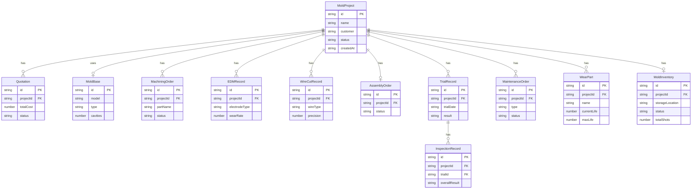

## 1. 架构设计

```mermaid
flowchart TB
    subgraph "前端层"
        "React 18 + TypeScript"
        "TailwindCSS 3"
        "React Router v6"
        "Recharts 图表库"
    end
    subgraph "数据层"
        "LocalStorage 持久化"
        "Mock 数据服务"
        "Zustand 状态管理"
    end
    "React 18 + TypeScript" --> "Zustand 状态管理"
    "Zustand 状态管理" --> "LocalStorage 持久化"
    "React 18 + TypeScript" --> "React Router v6"
    "React 18 + TypeScript" --> "Recharts 图表库"
```

## 2. 技术说明

- **前端框架**：React@18 + TypeScript + Vite
- **初始化工具**：Vite (react-ts 模板)
- **样式方案**：TailwindCSS@3 + CSS变量主题
- **路由**：React Router v6
- **状态管理**：Zustand（轻量级，支持持久化中间件）
- **图表库**：Recharts
- **图标**：Lucide React
- **后端**：无后端，使用 LocalStorage + Mock 数据
- **数据库**：无数据库，LocalStorage 持久化存储

## 3. 路由定义

| 路由 | 用途 |
|------|------|
| / | 仪表盘首页 |
| /quotation | 模具报价列表 |
| /quotation/new | 新建报价单 |
| /quotation/:id | 报价单详情 |
| /mold-base | 标准模架选型 |
| /machining | 零件加工管理 |
| /machining/:id | 加工工单详情 |
| /edm | 电火花电极 |
| /wire-cut | 慢走丝线切割 |
| /assembly | 模具装配钳工 |
| /assembly/:id | 装配工单详情 |
| /trial | 首次试模记录 |
| /inspection | 注塑产品检验 |
| /maintenance | 模具维修工单 |
| /wear-parts | 易损件更换 |
| /lifespan | 模具寿命统计 |
| /inventory | 模具入库台账 |

## 4. API定义

无后端API，使用 Zustand Store + LocalStorage 进行数据管理。

### 核心数据类型定义

```typescript
interface MoldProject {
  id: string;
  name: string;
  customer: string;
  productName: string;
  status: 'quotation' | 'design' | 'machining' | 'assembly' | 'trial' | 'accepted' | 'inventory';
  createdAt: string;
  deadline: string;
}

interface Quotation {
  id: string;
  projectId: string;
  materialCost: number;
  machiningCost: number;
  designCost: number;
  managementCost: number;
  totalCost: number;
  status: 'draft' | 'submitted' | 'approved' | 'rejected';
  createdAt: string;
}

interface MoldBase {
  id: string;
  model: string;
  type: string;
  cavities: number;
  size: string;
  material: string;
  supplier: string;
  price: number;
}

interface MachiningOrder {
  id: string;
  projectId: string;
  partName: string;
  partType: 'cavity' | 'core' | 'electrode' | 'other';
  processes: MachiningProcess[];
  status: 'pending' | 'processing' | 'completed';
}

interface MachiningProcess {
  name: string;
  machine: string;
  duration: number;
  status: 'pending' | 'processing' | 'completed';
}

interface EDMRecord {
  id: string;
  projectId: string;
  electrodeType: string;
  dischargeParams: DischargeParams;
  wearRate: number;
  status: 'pending' | 'processing' | 'completed';
}

interface WireCutRecord {
  id: string;
  projectId: string;
  wireType: string;
  cutParams: WireCutParams;
  precision: number;
  status: 'pending' | 'processing' | 'completed';
}

interface AssemblyOrder {
  id: string;
  projectId: string;
  steps: AssemblyStep[];
  issues: string[];
  status: 'pending' | 'processing' | 'completed';
}

interface AssemblyStep {
  name: string;
  description: string;
  status: 'pending' | 'processing' | 'completed';
}

interface TrialRecord {
  id: string;
  projectId: string;
  trialDate: string;
  machineNo: string;
  injectionParams: InjectionParams;
  sampleCondition: string;
  issues: string[];
  result: 'pass' | 'fail' | 'conditional';
}

interface InspectionRecord {
  id: string;
  projectId: string;
  trialId: string;
  items: InspectionItem[];
  overallResult: 'pass' | 'fail' | 'conditional';
}

interface InspectionItem {
  name: string;
  standard: string;
  measured: string;
  result: 'pass' | 'fail';
}

interface MaintenanceOrder {
  id: string;
  projectId: string;
  type: 'repair' | 'maintenance';
  description: string;
  assignee: string;
  status: 'pending' | 'processing' | 'completed';
  createdAt: string;
  completedAt?: string;
}

interface WearPart {
  id: string;
  projectId: string;
  name: string;
  specification: string;
  currentLife: number;
  maxLife: number;
  replacementHistory: ReplacementRecord[];
}

interface MoldInventory {
  id: string;
  projectId: string;
  storageLocation: string;
  status: 'in_stock' | 'out_stock' | 'maintenance';
  inDate: string;
  outDate?: string;
  totalShots: number;
}
```

## 5. 服务器架构图

不适用（无后端服务）

## 6. 数据模型

### 6.1 数据模型定义



### 6.2 数据定义语言

使用 TypeScript 类型定义替代 DDL，数据存储于 LocalStorage，按模块分 key 存储。
